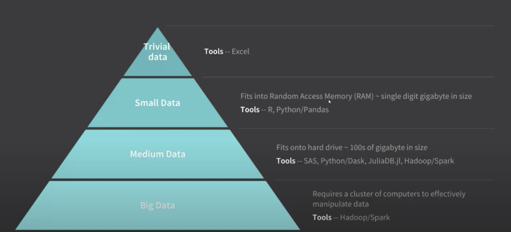

disk.frame
-----------
* What does this package do?

	* disk.frame performs a similar role to distributed systems such as Apache Spark, Python’s Dask, and Julia’s JuliaDB.jl for medium data which are datasets that are too large for RAM but not quite large enough to qualify as big data.

* You should use this package, if
	* You are dealing with medium size data(100s of gigabyte) 
	* would like to leverage from ssd level performance & paralelization to fasten your data analysis

* Any avaialble tutorial?
	* [if you don't have time (\~20 mins)](https://diskframe.com/articles/intro-disk-frame.html) 
	* [if you have time (> 1 hour)](https://www.youtube.com/watch?v=kjPjXs0mkwE)

* Main functions
	*  
	*  


Dependencies to Other Packages: 
Usability: 
Reaching to Large Audiance: 
Maintanance: 


Overall Score: Silver {height="10%" width="10%"}


Basic example to run
``` r
```

The users can refer to our paper [An accurate and robust imputation method scImpute for single-cell RNA-seq data](https://www.nature.com/articles/s41467-018-03405-7) for a detailed description of the modeling and applications.

Any suggestions on the package are welcome! For technical problems, please report to [Issues](https://github.com/Vivianstats/scImpute/issues). For suggestions and comments on the method, please contact Wei (<liw@ucla.edu>) or Dr. Jessica Li (<jli@stat.ucla.edu>).


``` r
install.packages("devtools")
library(devtools)

install_github("Vivianstats/scImpute")
```


For detailed usage, please refer to the package [manual](https://github.com/Vivianstats/scImpute/blob/master/inst/docs/) or [vignette](https://github.com/Vivianstats/scImpute/blob/master/vignettes/scImpute-vignette.Rmd).
